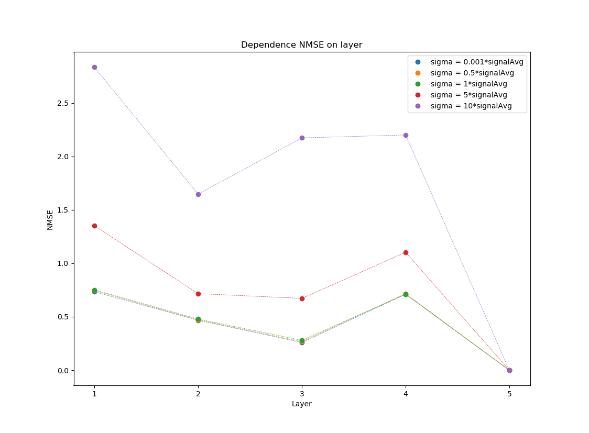

###### FFt test
1. In *SplitRadix.py* comparison of built in numpy *fft* and split radix *fft* is presented.
2. In *SplitRadixWithError.py* the dependence of NMSE of split radix *fft* with error on the number of layer 
is computed for different standard deviations of Gaussian distributions of error. According to 
presented graph, the 1st level acts like the most sensitive to noised multiplications. 
However the definition of levels is important in this analysis
